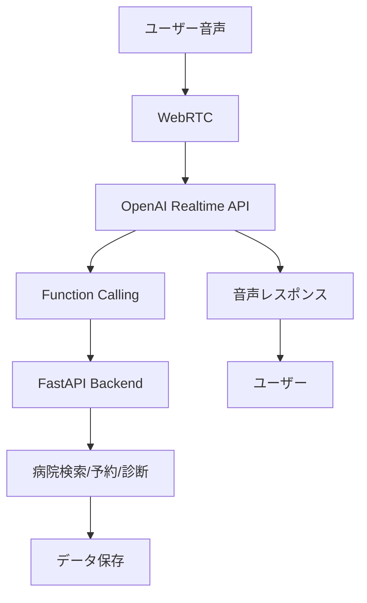

# Realtime Voice Agent - 医療予約システム

OpenAI Realtime APIを活用したリアルタイム音声対話型の医療予約エージェントです。ユーザーは音声で医療機関の検索、予約作成、症状の緊急度診断などを行うことができます。

## 🎯 主な機能

- **音声対話**: OpenAI Realtime APIによるリアルタイム音声会話
- **病院検索**: 位置情報を基にした近隣医療機関の検索
- **予約作成**: 音声による医療機関への予約システム
- **症状診断**: 症状の緊急度判定とアドバイス提供
- **関数呼び出し**: 音声コマンドから直接システム機能を実行

## 🏗️ システム構成

```
realtime-voice-agent/
├── api/                    # FastAPIバックエンド
│   ├── main.py            # APIエンドポイント定義
│   ├── agent.py           # 診断ロジック
│   ├── requirements.txt   # Python依存関係
│   └── Dockerfile         # APIコンテナ設定
├── web/                   # フロントエンド
│   └── realtime_demo.html # WebRTC音声UI
├── data/                  # データ保存ディレクトリ
└── docker-compose.yml     # サービス編成設定
```

## 🚀 セットアップ

### 1. 環境変数の設定

`.env`ファイルをプロジェクトルートに作成してください：

```bash
OPENAI_API_KEY=your_openai_api_key_here
OPENAI_REALTIME_MODEL=gpt-4o-realtime-preview
OPENAI_REALTIME_VOICE=verse
CORS_ORIGINS=http://localhost:5173
```

### 2. Docker Composeでの起動

```bash
# コンテナのビルドと起動
docker-compose up --build

# バックグラウンドで実行する場合
docker-compose up -d --build
```

### 3. ローカル開発環境での起動

#### APIサーバー（FastAPI）

```bash
cd api
pip install -r requirements.txt
uvicorn main:app --host 0.0.0.0 --port 8000 --reload
```

#### Webサーバー（静的ファイル）

```bash
# Pythonの簡易サーバーを使用
cd web
python -m http.server 5173

# または nginx、Apache等のWebサーバーを使用
```

## 🌐 アクセス方法

- **Web UI**: http://localhost:5173
- **API ドキュメント**: http://localhost:8000/docs
- **OpenAPI スキーマ**: http://localhost:8000/openapi.json

## 📖 使用方法

### 基本的な音声対話フロー

1. **接続**: Webページで「Connect & Talk」ボタンをクリック
2. **音声入力**: マイクに向かって話しかける
3. **自動処理**: AIが音声を理解し、必要に応じて以下の機能を実行
   - 病院検索（位置情報ベース）
   - 予約作成（病院ID、日時、患者名）
   - 症状診断（緊急度レベル判定）

### 音声コマンド例

```
「東京駅の近くの病院を探してください」
→ 位置情報を基に近隣医療機関を検索

「明日の午後2時に予約を取りたいです」
→ 指定日時での予約を作成

「頭痛と発熱があります」
→ 症状の緊急度を判定し、適切なアドバイスを提供
```

## 🔧 API エンドポイント

### 認証・セッション管理

- `POST /realtime/token` - OpenAI Realtime用の一時トークン発行

### 医療機関管理

- `GET /hospitals` - 近隣病院の検索
  - パラメータ: `lat`, `lon`, `distance_km`
  - レスポンス: 病院リスト（ID、名前、距離、空きスロット）

### 予約管理

- `POST /visit` - 医療機関予約の作成
  - ボディ: `{hospital_id, slot, name}`
  - 機能: JSON形式でデータディレクトリに保存

### 診断システム

- `POST /diagnose` - 症状に基づく緊急度判定
  - ボディ: `{symptoms}`
  - レスポンス: `{emergency_level, medical_report}`

## 🧪 技術スタック

### バックエンド
- **Python 3.12+**
- **FastAPI**: 高性能なWeb APIフレームワーク
- **uvicorn**: ASGI対応アプリケーションサーバー
- **httpx**: 非同期HTTPクライアント
- **Pydantic**: データバリデーション

### フロントエンド
- **HTML5 + JavaScript**: シンプルなWebインターフェース
- **WebRTC API**: リアルタイム音声通信
- **Fetch API**: REST API通信

### インフラ
- **Docker**: コンテナ化
- **nginx**: Webサーバー（本番環境）
- **OpenAI Realtime API**: 音声AI処理

## 📊 データフロー



## 🔧 開発・カスタマイズ

### 新機能の追加

1. **API エンドポイント**: `api/main.py`に新しいルートを追加
2. **音声機能**: OpenAI function callingの定義を更新
3. **フロントエンド**: `web/realtime_demo.html`の関数ハンドラーを拡張

### 診断ロジックの改善

`api/agent.py`の`run_web_diagnosis`関数を編集して、より高度な症状分析を実装できます。

### データベース連携

現在はファイルベースの保存ですが、PostgreSQL、MongoDB等のデータベースに簡単に移行可能です。

## 🚨 注意事項

- **API キー**: OpenAI API キーは適切に保護してください
- **HTTPS**: 本番環境ではHTTPS化が必要です（WebRTC要件）
- **音声データ**: 医療情報を含む音声データのプライバシー保護に注意
- **エラーハンドリング**: ネットワーク障害時の適切な処理を実装してください

## 📄 ライセンス

このプロジェクトはMITライセンスの下で公開されています。

## 🤝 コントリビューション

バグレポート、機能要求、プルリクエストを歓迎します。

---

**注意**: これは医療アドバイスを提供するものではありません。実際の医療判断には必ず医療従事者にご相談ください。
